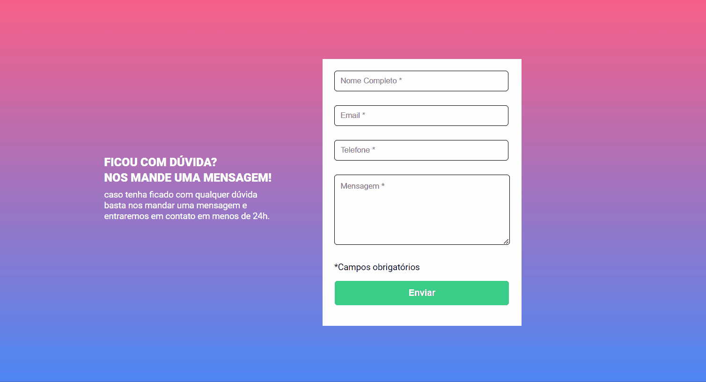

<h1 align="center"> Quest - Formulário </h1>

Este é um desafio proposto pelo curso de Desenvolvimento front-end do Dev em Dobro do módulo de JavaScript - Intermediário, onde criamos um formulário e a validação do mesmo é feito pelo JavaScript. 

 

  

## 🚀 Tecnologias

Esse projeto foi desenvolvido com as seguintes tecnologias:

- HTML e CSS
- JavaScript
- Git e Github
- Figma

## 💻 Projeto

Este formulário verifica a validação das informações, caso o os campos obrigatórios não sejam preenchidos, as bordas ficam vermelhas e a mensagem de "campo obrigatório" aparece, se todos os campos estiverem preenchidos as bordas ficaram verdes.

- [Visite o projeto online](https://jacquenunes.github.io/quest-formulario/)

## 🔖 Layout

Você pode visualizar o layout do projeto através [DESSE LINK](https://github.com/JacqueNunes/quest-formulario).

---

Feito por [Jacqueline Nunes](https://github.com/JacqueNunes)